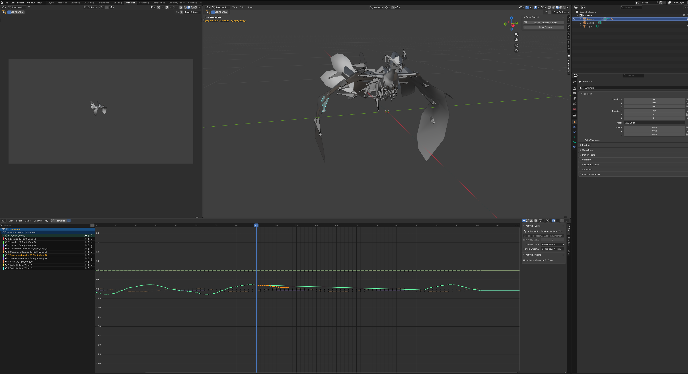

# Thyllore Animation — Blender Addon

The Blender addon shares Thyllore Animation's core ML logic (the Rust `thyllore_ml_core`
wheel) so the addon and the desktop engine run the *identical* ONNX model and numeric
pipeline. This page documents installation and the **Curve Copilot** feature.

## Download

The addon is packaged as a platform-specific extension ZIP by the **Blender Addon Build**
GitHub Actions workflow (`.github/workflows/blender_addon_build.yml`). Each run produces one
artifact per platform:

| Platform | Artifact name |
|---|---|
| Windows | `thyllore_animation_addon-win_amd64` |
| Linux | `thyllore_animation_addon-linux_x86_64` |
| macOS (Apple Silicon) | `thyllore_animation_addon-macosx_arm64` |

> Artifacts are retained for 7 days. After that, re-run the workflow to regenerate them.

### Via the GitHub UI

1. Open the repository's **Actions** tab and select the **Blender Addon Build** workflow.
2. Open the run you want, scroll to the **Artifacts** section at the bottom.
3. Download the artifact for your platform and unzip it — inside is the extension ZIP
   (e.g. `thyllore_animation_lite-0.0.1-linux_x86_64.zip`). Keep this ZIP as-is; do not
   unzip it further.

### Via the `gh` CLI

```bash
# List recent runs
gh run list --workflow "Blender Addon Build"

# Download a single platform's artifact from a run
gh run download <run-id> --name thyllore_animation_addon-linux_x86_64
```

### Building locally

To produce the ZIP without CI, run the wheel collection and build scripts in order
(see `scripts/`):

```bash
scripts/collect_wheels.sh --platforms linux_x86_64   # win_amd64 / macosx_11_0_arm64 also valid
scripts/build_blender_addon.sh --platform linux_x86_64
```

The ZIP is written to `dist/` (its path is also recorded in `dist/.last_built_zip`).

## Install in Blender

Requires **Blender 4.2 LTS or newer** (the addon ships as a Blender extension with a
`blender_manifest.toml`). Use the extension ZIP that matches your OS and CPU architecture.

1. Open **Edit → Preferences → Add-ons**.
2. Click the **▼ dropdown** at the top-right of the panel and choose **Install from Disk…**
   (in some builds this is the **Install…** button).
3. Select the downloaded extension ZIP (do not unzip it first).
4. Enable the checkbox next to **Thyllore Animation** in the add-on list.

Alternatively, **drag-and-drop the ZIP into the Blender window** — Blender 4.2+ recognises
extension ZIPs and offers to install them directly.

After enabling, configure the model path under **Preferences → Add-ons → Thyllore
Animation** (see [Preferences](#preferences) below). The **Curve Copilot** panel then
appears in the 3D Viewport N-panel under the **Thyllore** category when an armature is
the active object.

> The addon bundles the `thyllore_ml_core` wheel and the ONNX Runtime shared library for
> the target platform, so no extra Python packages are required. Installing a ZIP built
> for a different OS/architecture will fail to load the wheel.

## Curve Copilot

Curve Copilot is an AI-driven *forecast* for animation FCurves. While you animate, it
predicts how the selected channels will continue and draws the prediction as a
non-destructive **ghost curve** in the Graph Editor. It is a preview only — it never
inserts keyframes or edits the real FCurve.



In the screenshot the dashed coloured polylines in the Graph Editor (bottom) are the
forecasted ghost curves, one per selected channel, extending forward from the playhead.
The real keyframes remain untouched.

### How it works

1. Select one or more curves in the Graph Editor (each needs at least 2 keyframes).
2. Place the playhead **on or after** a keyframe of those curves.
3. Run **Preview Forecast** (`Shift+C`).

The addon extracts samples from the selected FCurve at the model's deploy rate
(`scene_fps / deploy_fps`, so the input matches the engine and the 60 fps training set
regardless of scene fps), hands them to the `thyllore_ml_core` wheel for inference, and
renders the returned polyline as a GPU ghost overlay. All numeric work — window offsets,
origin resolution, ONNX inference, continuity, and the ghost polyline — lives in the Rust
wheel as the single source of truth shared with the engine.

`rotation_quaternion` channels are forecast in Euler space (the trained representation):
the bone's full quaternion is converted to a continuous Euler curve, each axis is
forecast, then the result is converted back to a quaternion. Location, scale, and Euler
rotation channels are forecast directly.

### Toggle behaviour

`Shift+C` toggles the preview: press once to draw the forecast, press again to clear it.
This lets you quickly drop an unwanted prediction and redraw it from a new channel
selection or playhead position. **Clear Preview** removes the ghost explicitly.

### UI

The operators are exposed in the **Curve Copilot** panel (3D Viewport → N-panel →
Thyllore category), available when an armature is the active object:

| Control | Action |
|---|---|
| Preview Forecast (`Shift+C`) | Draw / clear the ghost forecast for the selected channels |
| Clear Preview | Remove the ghost curve |

### Preferences

Configure Curve Copilot under **Edit → Preferences → Add-ons → Thyllore Animation**:

| Setting | Description |
|---|---|
| Enable Curve Copilot | Turns the feature on/off |
| Curve Copilot Model Path | Path to `curve_copilot.onnx`. Leave empty to use the model the engine resolves from SharedData, falling back to the model bundled in the addon ZIP |

### Requirements

- The `thyllore_ml_core` wheel must be loaded (it provides the `curve_forecast`
  capability). If the wheel is absent, the operator is unavailable.
- An armature with an action containing FCurves.

## Distribution modes

Curve Copilot ships through three distribution modes — **degrade**, **full**, and
**private** — selected at build time (`--build-mode A|B|C`). The definition SSoT,
including the exact behaviour and required build environment variables, is
[`crates/thyllore-ml-core/src/mode.rs`](../crates/thyllore-ml-core/src/mode.rs)
(`CurveCopilotMode`).

| Mode | Addon build | Prediction context | Data sending |
|---|---|---|---|
| **degrade** | A (official repo) | ctx32 (reduced accuracy) | none |
| **full** | B (self-hosted repo) | ctx64 after opt-in | anonymized feedback records, opt-in only |
| **private** | C (Blender Market) | ctx64 via license activation | none |

In every mode the Preferences panel offers a **free-text feedback box** (sent only when
you press the button) and a link to the community Discord. Feedback records — the
learning pairs described below — exist only in **full** mode and only after explicit
opt-in.

## Data collection and training policy

- **What is sent (full mode, opt-in only):** per-channel curve-shape fragments — the
  curve the model predicted and the keyframe values you actually entered. No file
  names, object names, bone names, scene contents, or personal data are ever collected.
- **The original animation cannot be reconstructed** from the sent data
  (schema `curve_copilot_feedback/v1`): values are stored relative to an origin value
  and divided by the fragment's peak amplitude (the scale factor is never transmitted,
  so real units and magnitudes are lost), then quantized; timestamps are coarsened to
  day granularity and batches are shuffled, so fragments cannot be re-correlated into
  runs, bones, or timelines. Only the normalized curve shape needed for training
  remains.
- **What it is used for:** sent data feeds the model training pipeline (the model
  factory) exclusively, to improve the Curve Copilot model. It is not shared with third
  parties and is not used for any other purpose.
- **License-clean training:** the model is trained only on license-clean data — the
  CMU Motion Capture Database and the 100STYLE dataset — plus the opt-in feedback
  records above. No datasets with restrictive or unclear licensing are used, so models
  and predictions are safe to use in commercial work.

## License

- The Thyllore Animation project (engine and Rust crates, including
  `thyllore_ml_core`'s source) is licensed under **Apache License 2.0** (see the
  repository's `LICENSE`).
- The addon's Python files link against Blender's `bpy` API and are therefore licensed
  under **GPL-2.0-or-later** (see `blender_addon/LICENSE.md`), as required for Blender
  extensions.
- The bundled binary artifacts (the compiled `thyllore_ml_core` wheel and the ONNX
  model) are covered by the end-user license agreement in `blender_addon/EULA.md`.
- Third-party wheels carry their own upstream licenses; see
  `blender_addon/THIRD_PARTY_LICENSES.md`.

The feature set, distribution modes, endpoints, and these terms may change without
prior notice while the project is in pre-release development.
